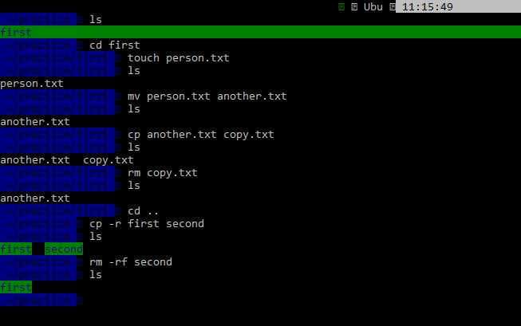
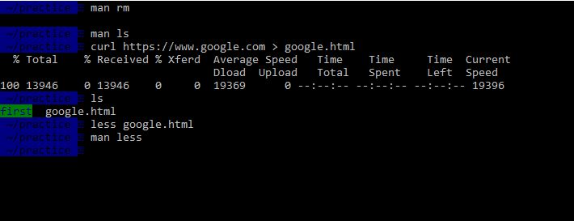

# PART I

(1 - 8)

# PART II

(1) The `man` command is used to refer to the manual for all terminal commands. I can scroll by pressing the up or down arrow on my keyboard. I can get out by pressing the `Q` button on my keyboard.

(2) The `-l` flag is used as a long listing format

(3 - 5)

 

(6) Hold `ctrl` then press either left arrow key or right arrow key on the keyboard.

(7) I can get to the end of a line in terminal by pressing the `end` key.

(8) I can move my cursor to the beginning in terminal by pressing the `home` key.

(9) By pressing `ctrl + w` or `ctrl + u`.

(10) Shell is a program which processes commands and returns output e.g <a href="https://zsh.org" target="_blank"> Zsh </a> while Terminal is a program that run a shell e.g <a href="https://ubuntu.com/download" target="_blank"> Ubuntu Terminal </a>

(11) An absolute path starts from the `root` directory.

(12) A relative path is relative to the starting location in the file system.

(13) A flag is used to specify an option for a command. Examples are -r -rf -a.

(14) The `-r` flag is used to remove directories and their contents recursively while the `-f` flag removes it by force.
