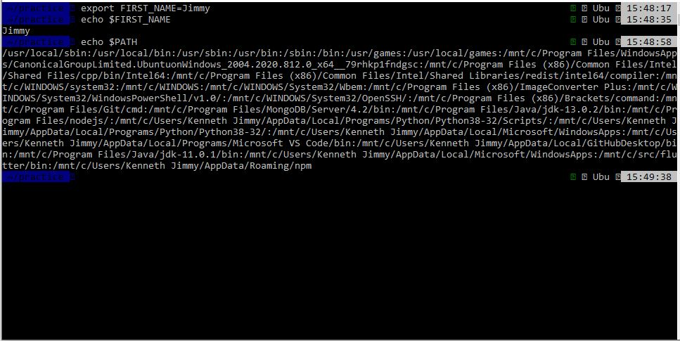

# PART I

(1 - 4)

(5) To store a piece of information I can always reuse with any program.

(6) By saving the environment variable expression inside my `.zshrc` file.

(7) A process is a program on your computer that is being run.

(8) By using the `ps aux` command

(9) The PID is a number that uniquely identifies the process.

(10) To kill a process, type kill and then the PID and hit enter. For example: `kill 10011`.

(11) `kill` sends the `TERM` signal telling it to terminate while `kill -9` sends a different signal. If killing a process doesn't work, killing with `-9` might get the job done.

(12) `-i`

(13) `-B`

(14) `-C`

(15) `-A`

(16) `-w`

(17) `-n`
