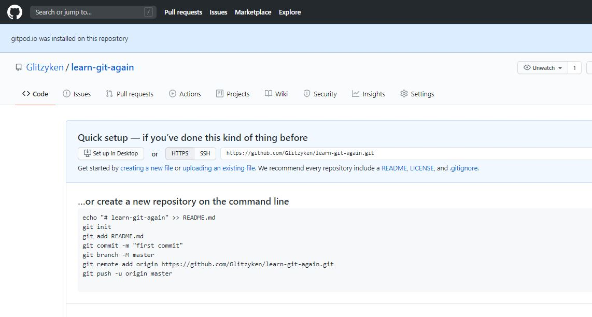
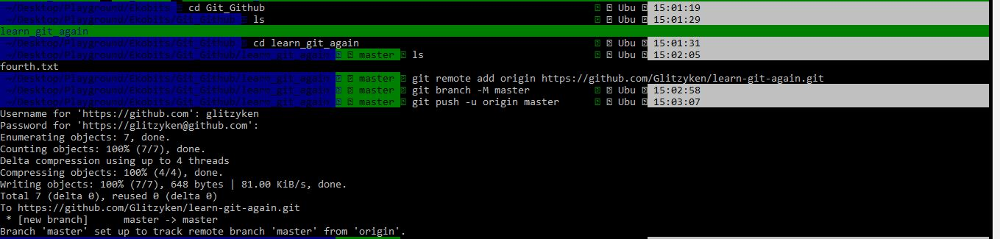
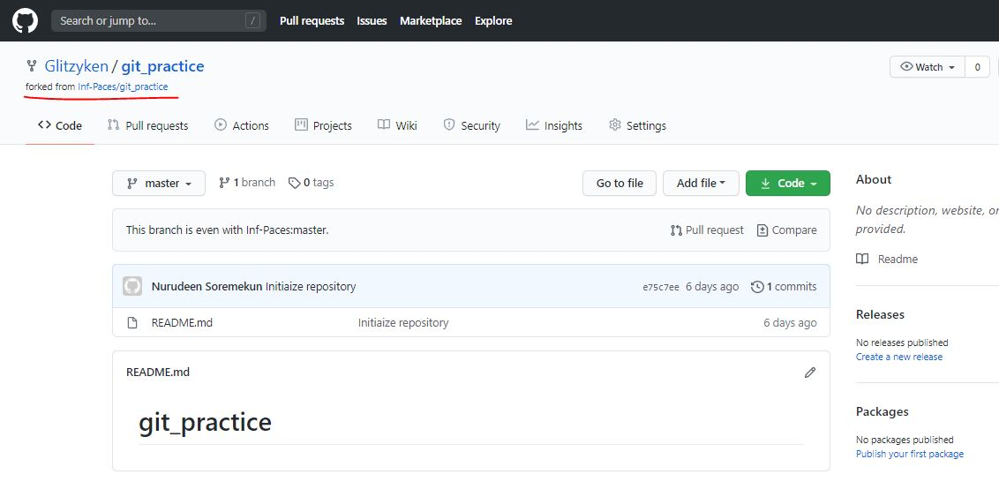
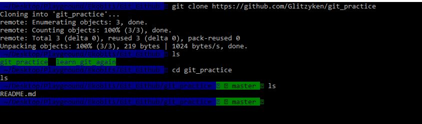
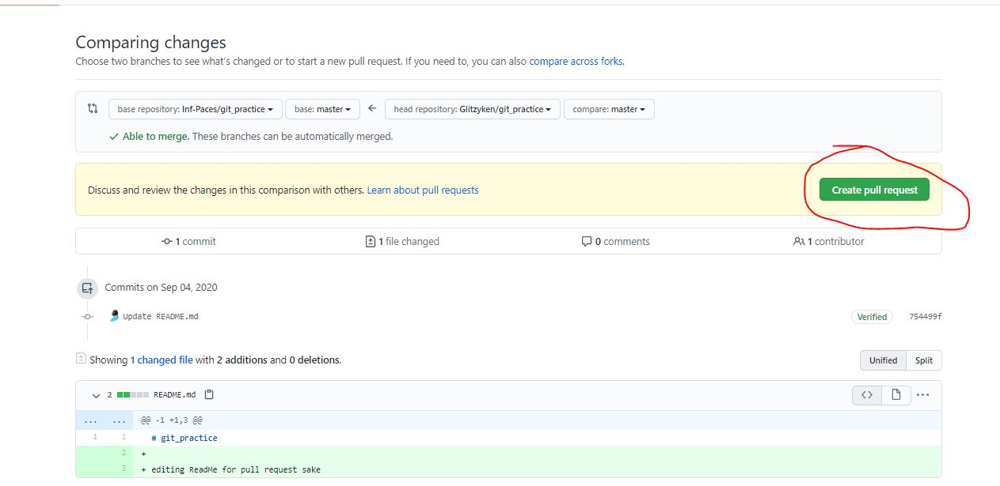
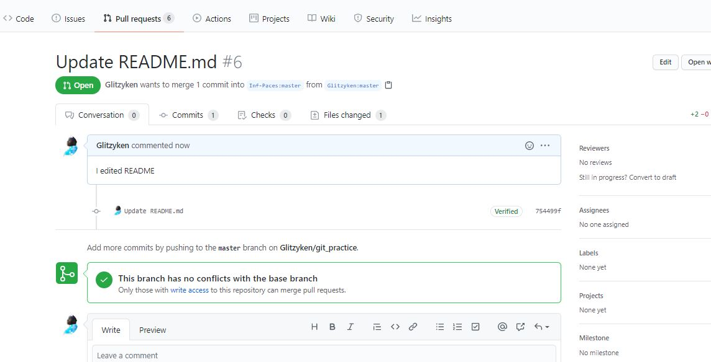
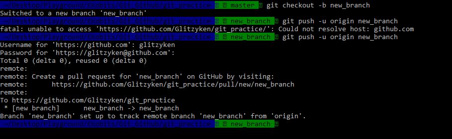
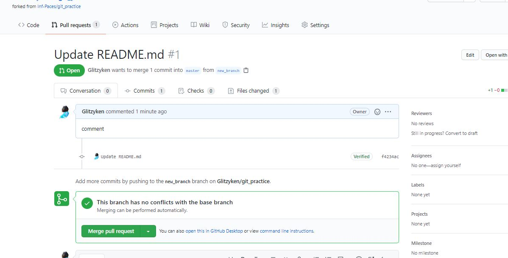

# PART I

(1 -2)

 

(3)

 

 

 

(4)

(5)

Open the Organization repository on GitHub and switch to the branch that you want to merge into master. Click New Pull Request to create a pull request. Enter brief details about the pull request and click Create pull request.

