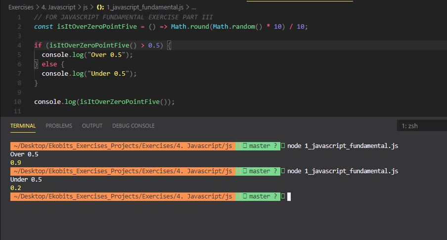

# Boolean Logic Exercises

# Part I

(1) `true`.

(2) `true`.

(3) `1`.

(4) `true`.

(5) `false`.

(6) `true`.

(7) `true`.

# Part II A

(1) The above code should console.log `Keep it up!`

(2) (i) We do not need to specify `if(isLearning === true)` because the `if` function is expecting a Boolean value and the `isLearning` variable is already assigned a Boolean value `true`. Therefore, simply passing the identifier `isLearning` will work just fine.

(2) (ii) The `if(isLearning)` on its own works because it is a `condition` that passes the test if it (that is, the condition) evaluates to `true`. Since `isLearning` is assigned the value of `true`, `if(isLearning)` works on its own.

# Part II B

(1) The above code should log `third` because the only condition that evaluates to `true` is `if(firstvariable || thirdvariable`.

(2) `undefined`.

(3) NO because in Javascript, all values are truthy unless they are defined as falsy (i.e., except for `false , 0 , -0 , 0n , "" , null , undefined ,` and `NaN` ) and since `firstvariable` is automatically assigned `undefined`, it is not a "truthy" value.

(4) NO because and empty string is not a value and thus `secondvariable` is not a "truthy" value.

(5) YES because `thirdvariable` is assigned a `number` which makes it a "truthy" value.

# Part III

(1)

(2) (i) A `falsy` value is a value that is considered `false` when encountered in a Boolean context.
(2) (ii) The 8 falsy values are: `false , 0 , -0 , 0n , "" , null , undefined ,` and `NaN`.
