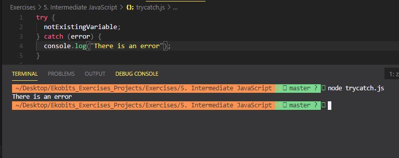

# Part I

## Answer the following questions:

- What does the throw keyword do?

  The `throw` keyword is used to stop code execution and return an error

- What does the finally keyword do?

  The `finally` keyword comes after the `catch` block and will execute regardless of an error being thrown

- What is the difference between a TypeError and ReferenceError?

  - `TypeError` occurs when you make incorrect use of certain types in javascript.
  - `ReferenceError` occurs when we try to access a variable that does not exist in that scope.

- How do you create a snippet in the Chrome dev tools?

  To create new code snippet, open DevTools, select `Sources` tab, and then `Snippets` tab on the left. It is next to page's own scripts and loaded extensions' tabs. Right click anywhere in the snippets' list and select `New`.

- What is an exception?

  An `exception` is an option in the Chrome dev tools used to pause the debugger in the Console so that you can get a chance to inspect what may have gone wrong.

- How do we "catch" errors in JavaScript? Give an example with code for what that might look like.

  By using a `try / catch` statement.

  Example:



## Explain what type of error will be thrown, why the error is occuring, and how to fix it:

`person;` will throw a `ReferenceError` if used because it is not assigned a value and thus does not exist. Assigning a value to `person` will fix the error.

`data.displayInfo();` will throw a `TypeError` because it is a function that does not exist. Defining the `displayInfo()` function inside the data object will fix the error.

`data.displayInfo.foo = "bar";` will throw a `TypeError` because it cannot set the property `foo` to a function that is `undefined`. To fix the problem, define the `displayInfo()` function inside the data object.

# Part II

## Fix the broken code and explain what was wrong:

1. ```
   for(let i=0; i > 5; i++){
      console.log(i);
   }

    for(let i=0; i < 5; i++){
      console.log(i);
    }

    'i' should be less than '<' 5
   ```

2. ```
   function addIfEven(num){
      if(num % 2 = 0){
          return num + 5;
      }
      return num;
   }

    function addIfEven(num){
      if(num % 2 === 0){
      return num + 5;
      }
    }

    it should be the strict equality operator '===' inside the if() statement and the 'return' statement inside the 'if' statement should suffice
   ```

3. ```
   function loopToFive(){
       for(let i=0, i < 5, i++){
           console.log(i);
       }
   }

   function loopToFive(){
       for(let i=0; i < 5; i++){
           console.log(i);
       }
   }

   The syntax should be semicolons (;) and not commas (,)
   ```

4. ```
    function displayEvenNumbers(){
      let numbers = [1,2,3,4,5,6,7,8];
      let evenNumbers = [];
      for(let i=0; i<numbers.length-1; i++;){
          if(numbers % 2 = 0); {
              evenNumbers.push(i);
          }
          return evenNumbers;
      }
    }
    displayEvenNumbers();

    function displayEvenNumbers() {
      let numbers = [1, 2, 3, 4, 5, 6, 7, 8];
      let evenNumbers = [];
      for (let i = 1; i <= numbers.length; i++) {
        if (i % 2 === 0) {
          evenNumbers.push(i);
        }
      }
      return evenNumbers;
    }

    displayEvenNumbers();

    (1) let i = 1, not 0
    (2) make 'i <= numbers.length'
    (3) remove -1 in front of numbers.length
    (4) remove semi-colon in front of i++
    (5) inside if() statement, replace 'numbers' with 'i'
    (6) replace '=' with '==='
    (7) delete the ';' behind the if() bracket
    (8) move 'return evenNumbers;' from the 'for' block to the function block
   ```
