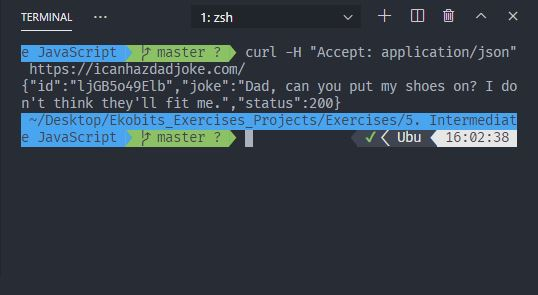

# Answer the following questions. Write out your answers in atext or markdown file.

### What is HTTP?

Hypertext Transfer Protocol. It is used to load web pages using hypertext links.

### What is a URL?

Uniform Resource Locator. It is used as a reference to a web resource.

### What is TCP?

Transmission Control Protocol. It originated in the initial network implementation and is complements the Internet Protocol.

### What is IP?

Internet Protocol. It is a numerical label assigned to each device connected to a computer network.

### What is DNS?

Domain Name System. It is a naming system for computers, services, or other resources connected to the Internet.

### What is idempotent?

Idempotent is an operation that can be repeated many times on a set of data and the state of the set of data will not change. For example, operations like a `GET` request.

### What is a query string?

A query string is a part of a URL that assigns values to specified parameters. As in anything after the `?` sign in the URL.

### What is a path or route?

A path or route may relate to a file that the web server has in its hard drive or an abstract resource that the web server is able to CRUD.

### List four HTTP Verbs and their use cases.

- GET: used to get or fetch resources from the web
- POST: used to create resources on the web
- PUT: used to update resources on the web
- DELETE: used to delete resources from the web

### What is a client?

Browser. Basically any software or hardware that can accesses a service made available by a server.

### What is a server?

A server is a hardware or software that provides functionality or services for other programs or devices also known as `clients`.

### What is an HTTP request?

HTTP request involves a computer making a request for some information at a URL from another computer.

### What is an HTTP response?

HTTP response involves a computer responding and returning some requested information to another computer.

### What is an HTTP header? Give a couple examples of request and response headers you have seen.

HTTP headers let the client and the server pass additional information with an HTTP request or response.
Examples:

    ```
        Request Method: GET
        Status Code: 200
        Remote Address: 216.58.223.228:443
        Referrer Policy: origin
    ```

### What is REST?

Representational State Transfer.

### What is JSON?

Javascript Object Notation.

### What happens when you type in "Hello World" in google.com and press enter?

The request-response cycle happens. The client first makes a request to "https://google.com", and the server responds with a status code of 200 and some HTML.

### What does it mean when we say the web is "stateless"?

This means that the end point does not "remember" things (such as who you are). It simply has no state.

### What is curl?

curl is a tool to transfer data from or to a server, using one of the supported protocols such as HTTP

### Make a GET request to the icanhazdadjoke API with curl to find all jokes involving the word "pirate." (your answer should be the curl command required).


